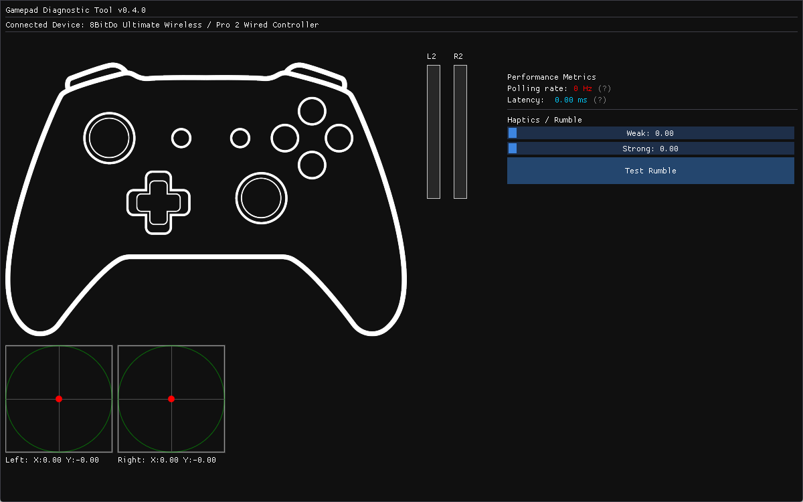

# Gamepad Tester

A high-performance diagnostic tool for gamepads, built with C++23 and SDL3. Designed for precise measurement of hardware performance and input visualization.



## Core Capabilities

*   **Latency Measurement:** High-precision hardware-to-OS input delay tracking using SDL3 high-resolution timestamps.
*   **Polling Rate Analysis:** Real-time frequency (Hz) monitoring with peak rate tracking to identify hardware limits and connection stability.
*   **Input Visualization:** Full mapping for axes, triggers, and buttons with real-time pressure and position feedback.
*   **Hardware Testing:** Built-in rumble/haptic feedback testing for both weak and strong motors.

## Technical Implementation

*   **Modern C++:** Built using the C++23 standard.
*   **Native Performance:** Utilizes SDL3 for low-level hardware access and cross-platform compatibility.
*   **Immediate Mode UI:** Powered by Dear ImGui for a lightweight and responsive interface.
*   **Standalone Build:** No external library installation required; all dependencies are managed automatically via CMake FetchContent.

## How to run
Download the latest release from [releases](https://github.com/zoltcode/Gamepad_Tester/releases) page.
   
### Linux and MacOS
Open your terminal and run:

```bash
mkdir Gamepad_Tester
tar -xzf gamepad_tester_linux_x86_64.tar.gz -C Gamepad_Tester
cd Gamepad_Tester && chmod +x gamepad_tester
./gamepad_tester
```

### Windows
You can right-click the `.zip` file and select **Extract All**, then run `gamepad_tester.exe`. 

Alternatively, use **PowerShell**:

```powershell
Expand-Archive -Path gamepad_tester_windows_x86_64.zip -DestinationPath Gamepad_Tester
cd Gamepad_Tester
.\gamepad_tester.exe
```

## Build from source

### Prerequisites
*   CMake 3.10 or higher
*   A C++23 compatible compiler (GCC 13+, Clang 16+, or MSVC 19.36+)

### Build Instructions
1. Clone the repository:
   ```bash
   git clone https://github.com/zoltcode/Gamepad_Tester.git
   cd Gamepad_Tester
   ```
2. Configure and build:
   ```bash
   cmake -B build -DCMAKE_BUILD_TYPE=Release
   cmake --build build --config Release
   ```

## Linux Note
On Linux systems, ensure your user has permissions to access `/dev/input/` devices.

## License
This project is licensed under the Apache 2.0 License. See the `LICENSE.txt` file for details.

### Notice on Assets
The source code of this project is licensed under the Apache License 2.0. Third-party assets, such as the icons, are subject to their own respective licenses and are not covered by the Apache 2.0 license.
